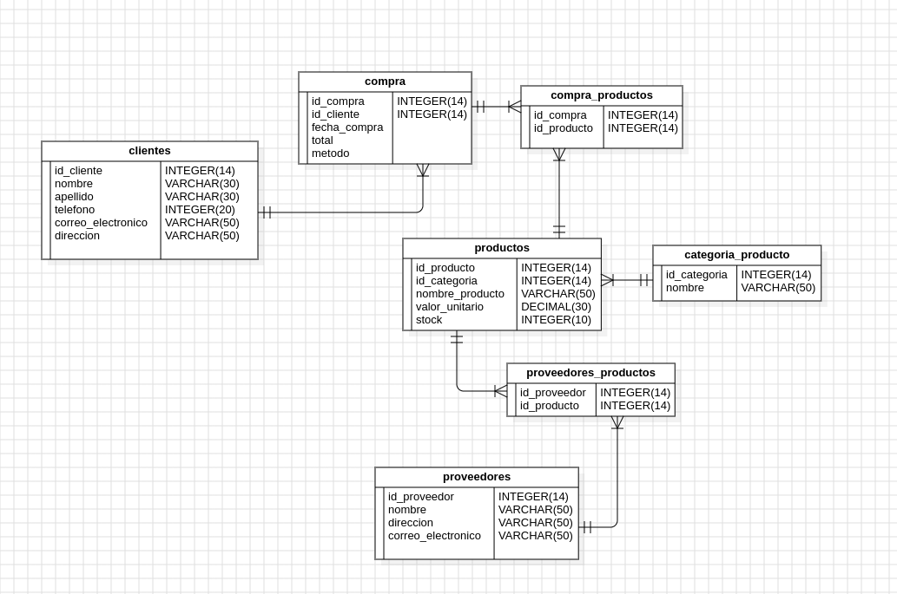

# un bello proyecto de postgre

este es un proyecto para ayudar a  una tienda de electrodomesticos en la cual se necesitaba llevar mejor manejo de las cuentas, por lo que se incluyo control de stock,ventas,facturas,clientes,compras entre otros.
funciona con postgre sql

# ORDEN DE EJECUCION

- db.sql
- insert.sql
- queries.sql
- mi ejecucion 

# modelo ER

